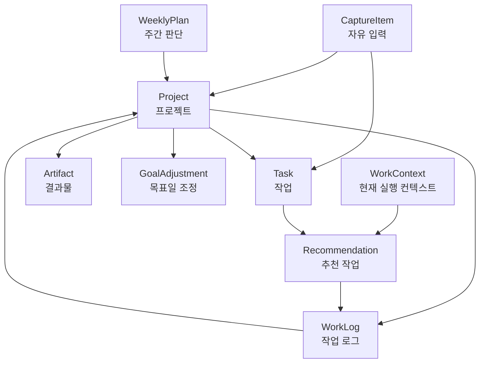

# Information Architecture

작성일: 2026-07-05

## 1. 목적

이 문서는 Personal Work OS가 다루는 정보의 구조를 정의한다.

아직 실제 데이터베이스 스키마가 아니다. 목표는 제품 화면, AI 판단, 이후 데이터 모델 설계가 같은 개념을 공유하도록 만드는 것이다.

핵심 질문:

- 이 제품은 어떤 객체를 관리하는가?
- 객체들은 어떻게 연결되는가?
- 사용자는 어떤 정보를 보고, AI는 어떤 정보를 내부적으로 쓰는가?
- 화면별로 어떤 정보가 중심이 되어야 하는가?

## 2. 핵심 정보 객체

MVP에서 필요한 핵심 객체는 다음 8개다.

1. Project
2. Task
3. WorkContext
4. WorkLog
5. Artifact
6. WeeklyPlan
7. Recommendation
8. GoalAdjustment

보조 객체:

- CaptureItem
- AIQuestion
- UserPreference

## 3. 객체 관계 요약

전체 관계는 다음과 같다.

핵심 루프:

CaptureItem -> Project 연결 -> Task 생성/분해 -> WorkContext 기준 Recommendation -> 실행 -> WorkLog -> Project 이해 업데이트

## 4. Project

### 역할

Project는 여러 작업과 로그가 연결되는 맥락 단위다.

이 제품에서 Project는 단순 폴더가 아니다. AI가 우선순위와 태스크 분해를 판단할 때 참조하는 "이해 단위"다.

### 사용자가 보는 정보

- 프로젝트 이름
- 최종 목표
- 상태 단계
- 현재 맥락 한 문장
- 결과물 목록
- 최근 진척 요약
- 다음 작은 결과물
- 다음 10분 행동
- 막힌 점
- 목표일

### AI가 내부적으로 쓰는 정보

- 프로젝트 목표
- 최근 높은 신뢰도 로그
- 최근 낮은 신뢰도 로그
- 결과물 생성 기록
- 목표일 변경 이력
- 주간 역할 이력
- 태스크 완료 패턴
- 자주 막히는 지점

### 프로젝트 상태 단계

초기 상태:

- 대기
- 조사 중
- 설계 중
- 실행 중
- 막힘
- 완료

상태 단계는 세밀한 진행률이 아니라 빠른 스캔용 라벨이다.

## 5. Task

### 역할

Task는 사용자가 하거나 AI가 추천할 수 있는 작업 단위다.

Task는 크게 두 종류로 나뉜다.

- 원본 작업: 사용자가 입력한 큰 할 일
- 실행 작업: AI가 현재 환경에서 할 수 있도록 쪼갠 작업

### 사용자가 보는 정보

- 작업 제목
- 연결된 프로젝트
- 상태
- 작업 강도
- 다음 행동 여부
- 추천 이유

### AI가 내부적으로 쓰는 정보

- 원본 입력
- 연결 프로젝트
- 분해된 하위 작업
- 필요한 환경
- 필요한 도구
- 적합한 작업 강도
- 목표 결과물과의 관련성
- 지연 위험

### Task 상태

초기 상태:

- 후보
- 추천됨
- 진행 중
- 완료
- 보류
- 취소

MVP에서는 복잡한 워크플로우보다 이 정도면 충분하다.

## 6. WorkContext

### 역할

WorkContext는 지금 추천 가능한 작업을 결정하는 현재 실행 조건이다.

사용자는 이 값을 직접 바꾼다. AI는 자동 추정하지 않는다.

### 필드

- 장소: 집 / 외부 / 이동 중
- 도구: 노트북 가능 / 휴대폰만
- 환경: 조용함 / 산만함
- 작업 강도: 가볍게 / 보통 / 깊게

### 사용자가 보는 정보

상단 실행 컨텍스트 바:

`집 · 노트북 · 조용함 · 보통`

### AI가 내부적으로 쓰는 정보

- 추천 가능 작업 필터링
- 작업 강도 자동 낮춤
- 태스크의 환경 맞춤 변환
- 추천 이유 생성

## 7. WorkLog

### 역할

WorkLog는 프로젝트 이해를 업데이트하는 핵심 기록이다.

작업 완료 후 사용자가 남긴 로그 또는 스킵 시 생성되는 자동 최소 로그가 여기에 해당한다.

### 사용자가 보는 정보

- 로그 시간
- 로그 요약
- 연결 프로젝트
- 연결 작업
- 다음 행동
- 막힌 점
- 자동 기록 여부

### AI가 내부적으로 쓰는 정보

- 로그 신뢰도
- 상태 변화 후보
- 다음 행동 후보
- 결과물 생성 여부
- 목표일 조정 신호
- 개인 작업 패턴

### 로그 신뢰도

높음:

- 사용자가 텍스트 또는 음성으로 맥락을 남김
- AI가 정리함

낮음:

- 사용자가 로그를 스킵함
- 작업 제목만 기반으로 자동 최소 로그 생성

낮은 신뢰도 로그는 최근 작업 여부에는 반영하지만, 실제 진척 판단에는 약하게만 반영한다.

## 8. Artifact

### 역할

Artifact는 프로젝트에서 실제로 남은 결과물이다.

사용자의 핵심 부담이 "결과물을 못 내고 있다"였기 때문에, 프로젝트에는 Task 완료보다 Artifact가 더 중요한 증거가 된다.

### 예시

- 문서
- 화면
- 코드
- 데모
- 글 초안
- 고객 가설
- 공부 노트
- 설계 결정 문서

### 사용자가 보는 정보

- 결과물 이름
- 유형
- 연결 프로젝트
- 생성 또는 업데이트 날짜
- 관련 로그

### AI가 내부적으로 쓰는 정보

- 최근 결과물 생성 여부
- 프로젝트 지연 위험
- 보류해도 되는 근거
- 다음 작은 결과물 제안

## 9. WeeklyPlan

### 역할

WeeklyPlan은 이번 주에 어떤 프로젝트를 전진/유지/보류/막힘으로 둘지 정하는 판단 단위다.

### 사용자가 보는 정보

- 이번 주 전진 프로젝트
- 유지 프로젝트
- 보류 프로젝트
- 막힘 프로젝트
- AI 제안 근거
- 사용자가 수정한 최종 판단

### AI가 내부적으로 쓰는 정보

- 최근 진척
- 최근 결과물
- 목표일 위험
- 프로젝트별 다음 행동 존재 여부
- 사용자가 느끼는 부담
- 이전 주 계획 이력

### 주간 역할

- 전진
- 유지
- 보류
- 막힘

## 10. Recommendation

### 역할

Recommendation은 AI가 지금 실행하기 좋다고 제안하는 작업이다.

Recommendation은 Task와 다르다. Task는 작업 자체이고, Recommendation은 특정 WorkContext에서 그 작업을 추천한 결과다.

### 사용자가 보는 정보

- 추천 작업 제목
- 연결 프로젝트
- 추천 이유
- 작업 강도
- 시작 버튼

### AI가 내부적으로 쓰는 정보

- 추천 생성 시점의 WorkContext
- 추천 근거
- 정렬 점수
- 사용자가 시작했는지 여부
- 완료 여부
- 완료 로그 여부

### 추천 이유 구성

추천 이유는 한 줄이어야 한다.

포함 가능한 근거:

- 이번 주 전진 프로젝트와 연결됨
- 현재 환경에서 가능함
- 다음 작은 결과물과 연결됨
- 최근 로그가 끊겨 복귀가 필요함
- 목표일 위험이 있음
- 작업 강도와 맞음

## 11. GoalAdjustment

### 역할

GoalAdjustment는 목표일이나 작은 결과물이 바뀐 이유를 기록한다.

목표일 변경의 핵심은 새 날짜보다 "왜 바뀌었는지"다.

### 사용자가 보는 정보

- 기존 목표일
- 새 목표일
- 변경 이유
- 연결 프로젝트
- 연결 작은 결과물

### AI가 내부적으로 쓰는 정보

- 예측 실패 이유
- 과소평가/과대평가 패턴
- 외부 일정 영향
- 컨디션 영향
- 작업 유형별 지연 패턴

## 12. CaptureItem

### 역할

CaptureItem은 아직 완전히 정리되지 않은 자유 입력이다.

모든 입력은 처음에 CaptureItem으로 들어온 뒤, AI에 의해 Project, Task, WorkLog, Idea 등으로 구조화된다.

### 예시

- "수집 시스템 정리해야 함"
- "밋업에서 만난 사람한테 연락해야 할 듯"
- "오늘 인증 흐름 보다가 쿠키 쪽이 애매했음"

### 처리 결과

CaptureItem은 처리 후 다음 중 하나 이상으로 변환된다.

- Task
- WorkLog
- Project 후보
- Artifact 후보
- 결정 필요 항목
- 일반 메모

## 13. AIQuestion

### 역할

AIQuestion은 AI가 확신이 낮을 때 사용자에게 던지는 좁은 질문이다.

### 원칙

- 한 번에 하나만 묻는다.
- 선택지는 최대 2개를 기본으로 한다.
- 사용자가 분류표를 직접 채우게 하지 않는다.
- 답하지 않아도 임시 분류가 가능해야 한다.

### 예시

- "이건 기존 프로젝트를 이어가는 일이야?"
- "이건 Work OS 프로젝트와 관련 있어?"
- "이건 결과물을 만들기 위한 작업이야?"

## 14. UserPreference

### 역할

UserPreference는 사용자의 장기적 선호와 작업 패턴을 저장한다.

MVP에서는 복잡한 설정 화면보다 AI가 로그에서 학습한 패턴 요약으로 시작한다.

### 초기 학습 대상

- 결과물을 잘 내는 방식
- 과소평가하는 작업 유형
- 과대평가하는 작업 유형
- 환경별 작업 성공률
- 작업 강도별 성공률
- 밋업 이후 흐름 깨짐 패턴

## 15. 화면별 정보 구조

### 오늘 작업 화면

중심 객체:

- WorkContext
- Recommendation
- Task
- WeeklyPlan

보여줄 정보:

- 상단 실행 컨텍스트 바
- 추천 작업 3개
- 추천 이유
- 빠른 수집 입력
- 이번 주 전진 프로젝트 요약

보여주지 않을 정보:

- 전체 프로젝트 목록
- 전체 미완료 태스크
- 복잡한 필터
- 긴 로그 목록

### 빠른 수집 플로우

중심 객체:

- CaptureItem
- AIQuestion
- Task
- Project

보여줄 정보:

- 자유 입력창
- AI의 처리 결과
- 필요한 경우 좁은 질문 하나
- 생성된 실행 작업

### 프로젝트 상세 화면

중심 객체:

- Project
- Artifact
- WorkLog
- Task
- GoalAdjustment

보여줄 정보:

- 최종 목표
- 상태 단계 + 현재 맥락 한 문장
- 결과물 목록
- 최근 진척 요약
- 다음 작은 결과물
- 다음 10분 행동
- 최근 로그
- 목표일과 조정 이력

### 주간 판단 화면

중심 객체:

- WeeklyPlan
- Project
- Artifact
- WorkLog
- GoalAdjustment

보여줄 정보:

- 전진/유지/보류/막힘 제안
- 각 제안의 근거
- 최근 진척
- 결과물 여부
- 목표일 위험
- 사용자 수정 옵션

## 16. 사용자에게 보여줄 정보와 숨길 정보

### 사용자에게 보여줄 정보

- 지금 해야 할 작업
- 추천 이유
- 프로젝트 목표
- 결과물
- 최근 진척
- 다음 행동
- 목표일 변경 이유

### 기본적으로 숨길 정보

- 내부 점수
- AI 확신도 세부 수치
- 복잡한 태그 후보 전체
- 추천 정렬 계산식
- 사용자가 직접 조작할 필요 없는 메타데이터

숨긴 정보는 필요할 때 "왜?"를 눌러 펼칠 수 있게 하는 정도가 적절하다.

## 17. IA 기준 MVP 우선순위

가장 먼저 구현되어야 하는 정보 흐름:

1. CaptureItem 생성
2. Project 연결
3. Task 생성/분해
4. WorkContext 기준 Recommendation 생성
5. WorkLog 생성
6. Project 최근 진척 업데이트

이 6개가 연결되면 제품의 핵심 루프가 동작한다.

나중으로 미룰 정보:

- 정교한 UserPreference
- GoalAdjustment 고도화
- Artifact 자동 감지
- WeeklyPlan 자동 최적화
- 고급 필터와 검색

## 18. 다음 문서로 이어지는 결정

이 IA를 바탕으로 다음 문서는 `data-model-draft.md`를 작성한다.

Data Model Draft에서는 위 객체를 실제 저장 가능한 형태로 바꾸되, 아직 특정 DB 제품이나 ORM에 묶이지 않는다.

